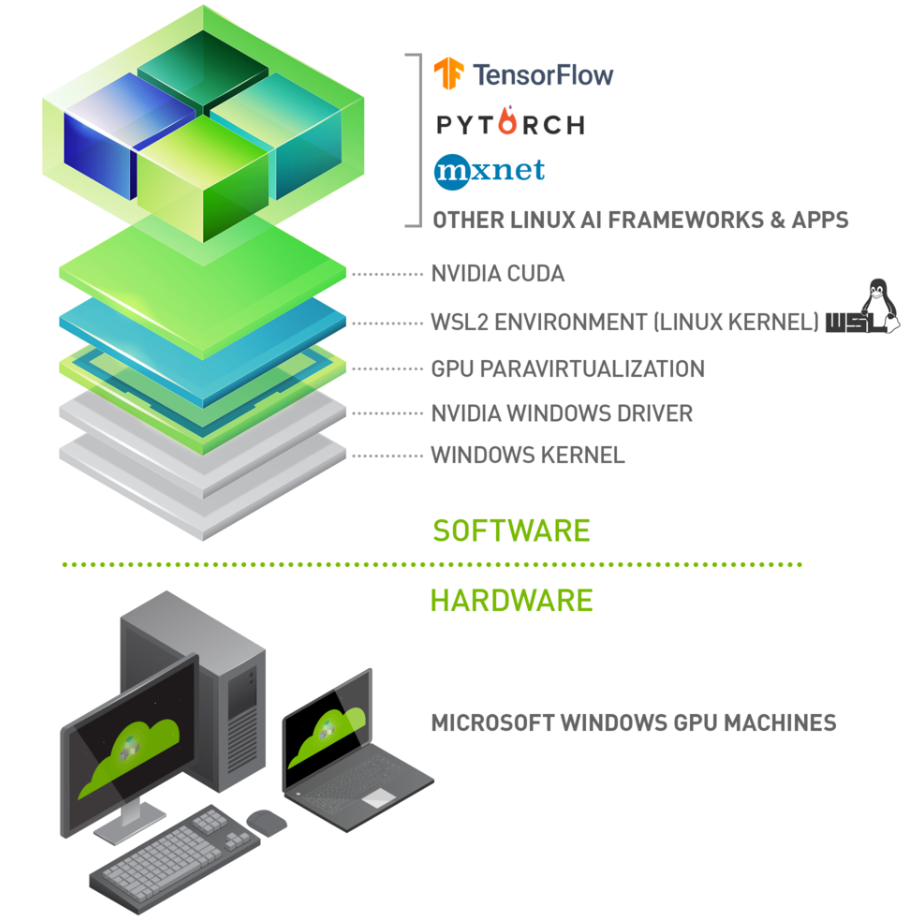
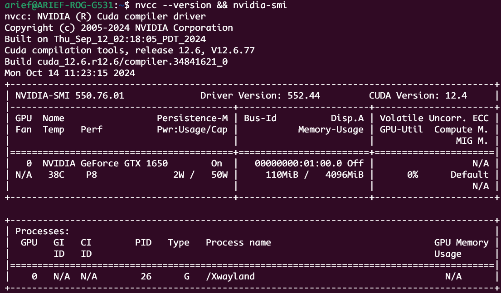

# CUDA Enabled WSL Setup

To allow effective use of graphic applications in WSL2, we can utilise dedicated graphics device to improve performance of the applications.

## Introduction
**Windows 11 and later updates of Windows 10** support running existing ML tools, libraries, and popular frameworks that use **NVIDIA CUDA** for **GPU hardware acceleration** inside a **Windows Subsystem for Linux (WSL)** instance. This includes PyTorch and TensorFlow as well as all the Docker and NVIDIA Container Toolkit support available in a native Linux environment.



### Installing the GPU driver
Download and install the NVIDIA CUDA enabled driver for WSL to use with your existing CUDA ML workflows. For more info about which driver to install, see: [Getting started with CUDA on WLS2](https://docs.nvidia.com/cuda/wsl-user-guide/index.html#getting-started-with-cuda-on-wsl)

### CUDA Toolkit Installation (Subject To Change)
The following instructions are set to change with new driver versions. See [CUDA on WSL User Guide](https://docs.nvidia.com/cuda/wsl-user-guide/index.html#getting-started-with-cuda-on-wsl-2) for the most up to date information.

> [!NOTE]\
> There is an underlying assumption that the `host` system is installed with the latest or higher than `version 440`. In most modern systems this is the case, however if in doubt, see [manual driver installation](https://www.nvidia.com/Download/index.aspx)`

1. In `WSL2`, First remove the old GPG key:
```shell
sudo apt-key del 7fa2af80
```

2. Head to the [Download page for WSL-Ubuntu](https://developer.nvidia.com/cuda-downloads?target_os=Linux&target_arch=x86_64&Distribution=WSL-Ubuntu&target_version=2.0&target_type=deb_local) and follow the instructions. Ensure that all commands are executed in-order.

3. Once installed, the `CUDA toolkit executable` must be added to the `PATH` system variable. Perform the following steps.

Head to the `home` directory
```shell
cd ~
```

Open the `.bashrc` file using a text editor (`nano` is used in this case)
```shell
nano .bashrc
```

Append the following line to the bottom of the `.bashrc` file
```shell
# Add CUDA toolkit to the PATH variable
export PATH=/usr/local/cuda-12.6/bin${PATH:+:${PATH}}
```

Save the file (ctrl + X in `nano`) and re-open a terminal. Once a new terminal is open, execute the following command.
```shell
nvcc --version && nvidia-smi
```

The commands output should be similar to the following.


This concludes the installation process. Proceed to verify the installation.

### CUDA Toolkit Verification
Before continuing, it is important to verify that the CUDA toolkit can find and communicate correctly with the CUDA-capable hardware. To do this, you need to compile and run some of the sample programs, located in the [CUDA samples](https://github.com/nvidia/cuda-samples.) repository.

1. Clone the `CUDA samples` repository
```shell
git clone https://github.com/NVIDIA/cuda-samples.git
```

2. Head into the downloaded `cuda-samples` directory
```shell
cd cuda-samples
```

3. Head to the `deviceQuery` sample project
```shell
cd Samples/1_Utilities/deviceQuery
```

4. Use `make` to build and compile the project
```shell
make 
```

5. Run the project executable
```shell
./deviceQuery
```

The output should be similar to the following.
```shell
./deviceQuery Starting...

 CUDA Device Query (Runtime API) version (CUDART static linking)

Detected 1 CUDA Capable device(s)

Device 0: "NVIDIA GeForce GTX 1650"
  CUDA Driver Version / Runtime Version          12.4 / 12.6
  CUDA Capability Major/Minor version number:    7.5
  Total amount of global memory:                 4096 MBytes (4294639616 bytes)
  (016) Multiprocessors, (064) CUDA Cores/MP:    1024 CUDA Cores
  GPU Max Clock rate:                            1560 MHz (1.56 GHz)
  Memory Clock rate:                             4001 Mhz
  Memory Bus Width:                              128-bit
  L2 Cache Size:                                 1048576 bytes
  Maximum Texture Dimension Size (x,y,z)         1D=(131072), 2D=(131072, 65536), 3D=(16384, 16384, 16384)
  Maximum Layered 1D Texture Size, (num) layers  1D=(32768), 2048 layers
  Maximum Layered 2D Texture Size, (num) layers  2D=(32768, 32768), 2048 layers
  Total amount of constant memory:               65536 bytes
  Total amount of shared memory per block:       49152 bytes
  Total shared memory per multiprocessor:        65536 bytes
  Total number of registers available per block: 65536
  Warp size:                                     32
  Maximum number of threads per multiprocessor:  1024
  Maximum number of threads per block:           1024
  Max dimension size of a thread block (x,y,z): (1024, 1024, 64)
  Max dimension size of a grid size    (x,y,z): (2147483647, 65535, 65535)
  Maximum memory pitch:                          2147483647 bytes
  Texture alignment:                             512 bytes
  Concurrent copy and kernel execution:          Yes with 2 copy engine(s)
  Run time limit on kernels:                     Yes
  Integrated GPU sharing Host Memory:            No
  Support host page-locked memory mapping:       Yes
  Alignment requirement for Surfaces:            Yes
  Device has ECC support:                        Disabled
  Device supports Unified Addressing (UVA):      Yes
  Device supports Managed Memory:                Yes
  Device supports Compute Preemption:            Yes
  Supports Cooperative Kernel Launch:            Yes
  Supports MultiDevice Co-op Kernel Launch:      No
  Device PCI Domain ID / Bus ID / location ID:   0 / 1 / 0
  Compute Mode:
     < Default (multiple host threads can use ::cudaSetDevice() with device simultaneously) >

deviceQuery, CUDA Driver = CUDART, CUDA Driver Version = 12.4, CUDA Runtime Version = 12.6, NumDevs = 1
Result = PASS
```

If the `Result` is a `PASS` then congratulations, you have sucessfully installed and configured `CUDA` on `WSL2`.